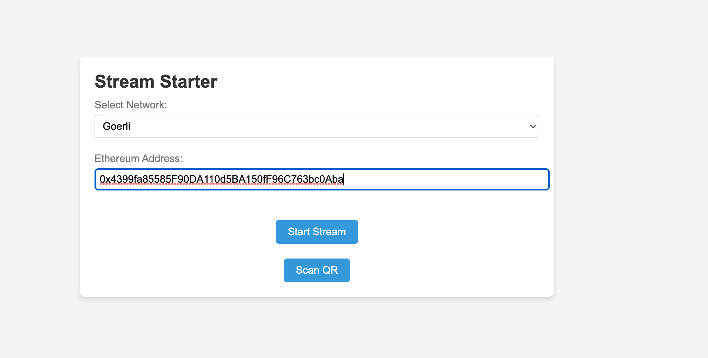

# Superfluid Stream Starter

This is a web application that allows users to start Superfluid streams by providing their Ethereum address and selecting the desired network. It utilizes the Superfluid protocol to create continuous streams of tokens between addresses.

## Features

- Scan QR code or manually enter Ethereum address
- Select the network (e.g., Goerli, Gnosis)
- Start a Superfluid stream
- Display transaction status and hash

## Getting Started

To get started with the Superfluid Stream Starter, follow these steps:

1. Clone the repository:

```bash
git clone https://github.com/ngmachado/superfluid-stream-starter.git
```

2. Install dependencies:

```bash
cd superfluid-stream-starter
yarn install
```

3. Start the Server:

```bash
yarn start
```

4. Open the application in your browser:
```bash
http://localhost:3000
```

5. Log in with your username and password.

## Dependencies

- Node.js
- Express.js
- HTML5 QR Code Library
- ethers.js
- Superfluid protocol

## Screenshots

### Login Page


### Send Transaction



### Transaction Status


### Dashboard


### Explorer - User Data Tag


## License

This project is licensed under the MIT License. See the [LICENSE](LICENSE) file for details.